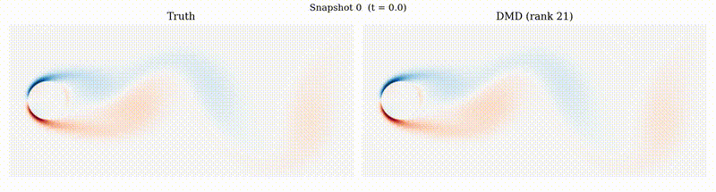

# DMD Analysis of Cylinder Wake Vortex Shedding

Dynamic Mode Decomposition (DMD) applied to 2D vorticity fields behind a circular cylinder at Re = 100. The analysis recovers the vortex shedding Strouhal number (St = 0.166), decomposes the wake into frequency-ranked spatial modes, and benchmarks standard DMD against POD and Bagging Optimized DMD (BOPDMD).

## Dataset

Vorticity snapshots from the Kutz & Brunton CFD cylinder flow dataset:
- **Grid**: 449 x 199 (streamwise x cross-stream), 89,351 spatial points
- **Snapshots**: 151 time steps, dt = 0.2 (non-dimensional)
- **Source**: [dmdbook.com/DATA.zip](http://dmdbook.com/DATA.zip) — extract `CYLINDER_ALL.mat` into `data/`

## Setup

```bash
python3 -m venv .venv
source .venv/bin/activate
pip install -r requirements.txt
```

Download the data:
```bash
mkdir -p data
wget -P data/ http://dmdbook.com/DATA.zip
unzip -o -j data/DATA.zip "DATA/FLUIDS/CYLINDER_ALL.mat" -d data/
rm data/DATA.zip
```

## Usage

Generate all figures (takes ~3 minutes):
```bash
python scripts/run_all.py
```

Or run individual scripts:
```bash
python scripts/01_data_exploration.py
python scripts/02_svd_rank.py
# ... etc
```

Run the Strouhal validation test:
```bash
python -m pytest tests/test_strouhal.py -v
```

## Project Structure

```
src/
  load.py          Data loader (handles MATLAB column-major ordering)
  dmd_runner.py    DMD wrapper with correct PyDMD time metadata
  pod.py           POD via truncated SVD

scripts/
  01_data_exploration.py      Snapshots, mean fields, fluctuations
  02_svd_rank.py              Singular spectrum and rank selection
  03_dmd_fitting.py           Eigenvalues, frequency spectrum, modes
  04_reconstruction.py        Reconstruction quality and harmonic buildup
  05_spectral_centreline.py   Wake physics: centreline profiles, spectra
  06_pod_comparison.py        POD modes and DMD vs POD
  07_sensitivity_bopdmd.py    Rank sensitivity and BOPDMD comparison
  08_animation.py             True vs reconstructed animation
  run_all.py                  Runs all scripts in sequence

tests/
  test_strouhal.py            Validates St = 0.166 +/- 5%

figures/                      All outputs (fig01-fig28)
```

## Animation

True vs DMD-reconstructed vorticity (151 snapshots, rank 21):



## Key Results

- **Strouhal number**: St = 0.1654 (reference: 0.166, Williamson 1996) — within 0.4%
- **Reconstruction error**: 0.077% at rank 21
- **Energy capture**: 99.9% with 21 singular values
- **Strouhal stability**: Recovered correctly across all tested ranks (3 to 81)
- **Growth rates**: All modes near-neutral (max |growth| = 0.00014), confirming limit-cycle dynamics

## References

- Kutz, Brunton, Brunton & Proctor, *Dynamic Mode Decomposition* (SIAM, 2016)
- Tu et al., *On Dynamic Mode Decomposition: Theory and Applications* (J. Comp. Dyn., 2014)
- Williamson, *Vortex Dynamics in the Cylinder Wake* (Ann. Rev. Fluid Mech., 1996)
- Thompson, Radi, Rao, Sheridan & Hourigan, *Low-Reynolds-number wakes of elliptical cylinders* (J. Fluid Mech., 2014)
